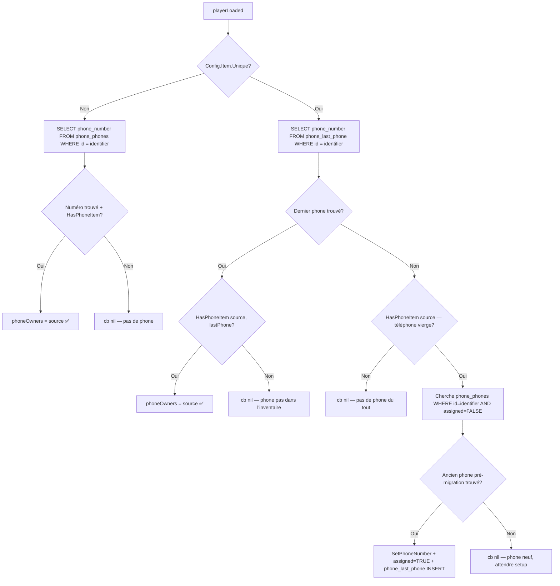
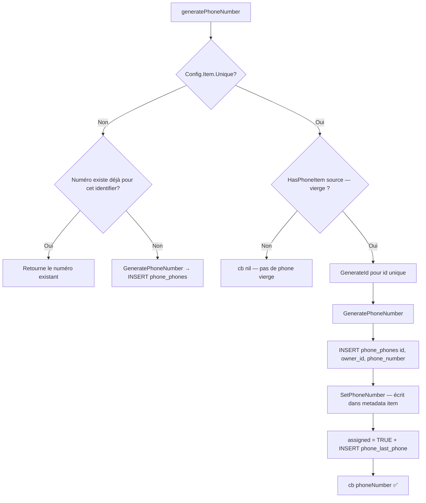
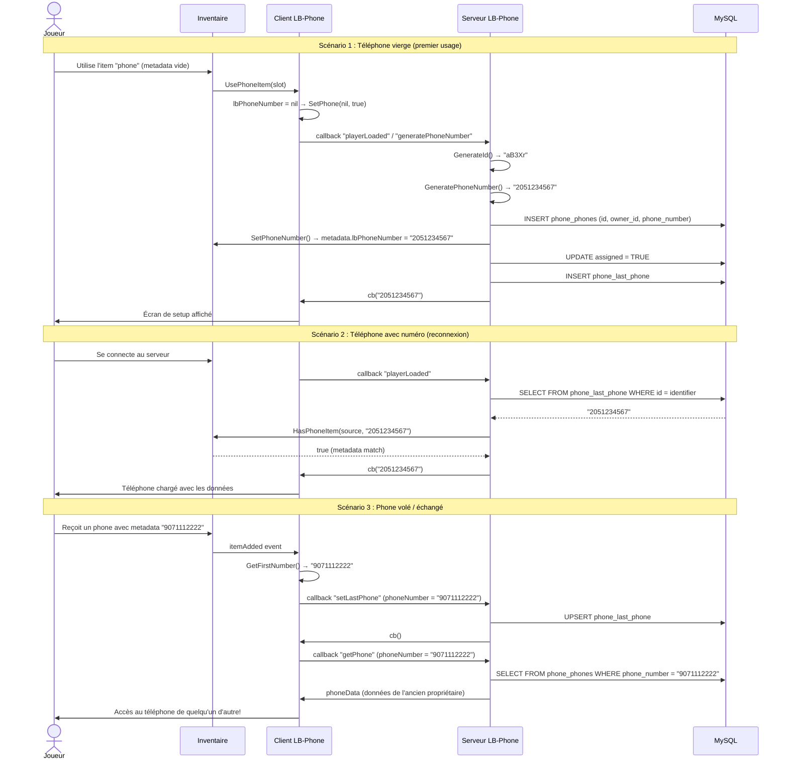

# Documentation Complète : UniquePhone (LB-Phone)

## Table des matières

1. [Concept](#1-concept)
2. [Configuration](#2-configuration)
3. [Schéma de Base de Données](#3-schéma-de-base-de-données)
4. [Flux Serveur Détaillé](#4-flux-serveur-détaillé)
5. [Métadonnées d'Inventaire](#5-métadonnées-dinventaire)
6. [Adaptateurs par Inventaire](#6-adaptateurs-par-inventaire)
7. [Fonctions Client](#7-fonctions-client)
8. [Exports Utiles](#8-exports-utiles)
9. [Intégration Custom / Standalone](#9-intégration-custom--standalone)
10. [Résumé Visuel du Flux](#10-résumé-visuel-du-flux)

---

## 1. Concept

### Mode Normal (Unique = false)
- **1 joueur = 1 numéro de téléphone**, lié à son `identifier` (colonne `id` de `phone_phones`).
- Le numéro est permanent et suit le personnage, pas l'item.
- Tous les joueurs partagent le même pool de données, le téléphone est juste un "passe" pour y accéder.

### Mode Unique (Unique = true)
- **1 item téléphone = 1 numéro de téléphone unique**, stocké dans les **métadonnées de l'item** (`lbPhoneNumber`).
- Un joueur peut posséder **plusieurs téléphones** avec des numéros différents.
- Les téléphones peuvent être **volés, échangés, donnés** — le numéro suit l'item physique, pas le joueur.
- Quand un joueur utilise un téléphone vierge (sans métadonnée), un nouveau numéro est généré et assigné à cet item.

> [!IMPORTANT]
> `Config.Item.Unique = true` **nécessite obligatoirement** `Config.Item.Require = true` (le joueur doit posséder l'item dans son inventaire). Le script affiche un warning si ce n'est pas le cas.

---

## 2. Configuration

Les 3 clés essentielles dans [config.lua](file:///e:/sadoj/script/leak/lb-phone/config/config.lua):

```lua
Config.Item.Require = true   -- Obliger l'item téléphone pour utiliser le phone
Config.Item.Unique  = true   -- Activer le mode unique phone
Config.Item.Name    = "phone" -- Nom de l'item dans l'inventaire

Config.Item.Inventory = "auto" -- Auto-détection de l'inventaire
-- Valeurs supportées : "ox_inventory", "qb-inventory", "lj-inventory",
--   "core_inventory", "mf-inventory", "qs-inventory", "codem-inventory"
```

> [!NOTE]
> Si `Config.Item.Inventory = "auto"`, le script détecte automatiquement l'inventaire dans [shared/functions.lua](file:///e:/sadoj/script/leak/lb-phone/shared/functions.lua) en vérifiant quelle resource est démarrée parmi la liste supportée.

---

## 3. Schéma de Base de Données

Deux tables SQL sont au cœur du système unique phone :

### Table `phone_phones`

```sql
CREATE TABLE IF NOT EXISTS `phone_phones` (
    `id` VARCHAR(100) NOT NULL,        -- Unique: ID aléatoire (5 chars) | Normal: player identifier
    `owner_id` VARCHAR(100) NOT NULL,  -- Identifier du premier utilisateur du téléphone
    `phone_number` VARCHAR(15) NOT NULL,
    `name` VARCHAR(50),
    `pin` VARCHAR(4) DEFAULT NULL,
    `face_id` VARCHAR(100) DEFAULT NULL,
    `settings` LONGTEXT,
    `is_setup` BOOLEAN DEFAULT FALSE,
    `assigned` BOOLEAN DEFAULT FALSE,  -- Si le téléphone est assigné à un item (metadata)
    `battery` INT NOT NULL DEFAULT 100,
    `last_seen` TIMESTAMP NOT NULL DEFAULT CURRENT_TIMESTAMP ON UPDATE CURRENT_TIMESTAMP,
    PRIMARY KEY (`id`),
    UNIQUE KEY (`phone_number`)
);
```

| Colonne | Mode Normal | Mode Unique |
|---------|-------------|-------------|
| `id` | `identifier` du joueur (ex: `license:xxx`) | ID aléatoire de 5 caractères (généré par `GenerateId()`) |
| `owner_id` | = `id` | `identifier` du premier utilisateur |
| `assigned` | Non utilisé | `TRUE` quand l'item a le numéro en metadata |

### Table `phone_last_phone`

```sql
CREATE TABLE IF NOT EXISTS `phone_last_phone` (
    `id` VARCHAR(100) NOT NULL,        -- Identifier du joueur
    `phone_number` VARCHAR(15) NOT NULL,
    PRIMARY KEY (`id`),
    FOREIGN KEY (`phone_number`) REFERENCES `phone_phones`(`phone_number`)
);
```

> [!TIP]
> `phone_last_phone` retient **le dernier téléphone utilisé** par chaque joueur. C'est ce qui permet au script de savoir quel téléphone ré-équiper au login. Elle est uniquement utilisée en mode Unique.

---

## 4. Flux Serveur Détaillé

Tous les flux ci-dessous se trouvent dans [server/server.lua](file:///e:/sadoj/script/leak/lb-phone/server/server.lua).

### 4.1 Génération d'un numéro — `GeneratePhoneNumber()`

```lua
function GeneratePhoneNumber()
    -- 1. Choisit un préfixe aléatoire dans Config.PhoneNumber.Prefixes
    -- 2. Génère Config.PhoneNumber.Length chiffres aléatoires
    -- 3. Vérifie dans phone_phones que le numéro n'existe pas déjà
    -- 4. Boucle jusqu'à trouver un numéro unique
    return fullNumber -- ex: "2051234567"
end
```

### 4.2 Chargement du joueur — callback `playerLoaded`

Ce callback est déclenché quand un joueur se connecte ou charge son personnage.



Le flow "Non" → cherche un téléphone existant non-assigné est une **migration automatique** : si le joueur avait un téléphone avant l'activation du mode Unique, ce téléphone est automatiquement assigné à son item vierge.

### 4.3 Génération d'un numéro pour un téléphone vierge — callback `generatePhoneNumber`

Déclenché quand un joueur utilise un téléphone **sans numéro assigné** (metadata `lbPhoneNumber = nil`).



**En résumé** : quand un joueur ouvre un téléphone vierge en mode Unique :
1. Un **ID unique de 5 caractères** est généré pour la colonne `id` de `phone_phones`
2. Un **numéro de téléphone** est généré (préfixe + X chiffres)
3. Le numéro est **écrit dans les métadonnées de l'item** (`lbPhoneNumber`, `lbFormattedNumber`)
4. L'entrée BDD est marquée `assigned = TRUE`
5. La table `phone_last_phone` est mise à jour

L'event `lb-phone:phoneNumberGenerated` est déclenché côté serveur avec `(source, phoneNumber)`.

### 4.4 Changement de téléphone — callback `setLastPhone`

Quand un joueur **change de téléphone** (utilise un autre item) :

```lua
-- Si phoneNumber est nil → le joueur ferme/dés-équipe son téléphone
-- Si phoneNumber existe → le joueur équipe un nouveau téléphone
-- Vérifie que le numéro existe dans phone_phones
-- Met à jour phone_last_phone (UPSERT)
-- Nettoie le cache settings de l'ancien téléphone
```

### 4.5 Récupération des données du phone — callback `getPhone`

```lua
-- Vérifie HasPhoneItem(source, phoneNumber)
-- SELECT owner_id, is_setup, settings, name, battery FROM phone_phones WHERE phone_number = ?
-- Si pas de owner_id → met à jour avec l'identifier du joueur actuel
-- Retourne les données pour le NUI
```

### 4.6 Factory Reset

```lua
function FactoryReset(phoneNumber)
    -- Supprime tous les comptes connectés (phone_logged_in_accounts)
    -- Réinitialise is_setup, settings, pin, face_id
    -- Déclenche l'event client phone:factoryReset
    -- Nettoie le cache serveur
end

exports("FactoryReset", FactoryReset)
```

> [!NOTE]
> Le factory reset **ne supprime PAS** les données des réseaux sociaux (Birdy, InstaPic, etc.) ni les messages. Il remet juste le téléphone en état "vierge" (écran setup).

### 4.7 Nom du téléphone

Quand un joueur nomme son téléphone (event `phone:setName`) :
- Le nom est sauvegardé en BDD (`phone_phones.name`)
- En mode Unique + si `SetItemName` existe : le nom est aussi écrit dans les **métadonnées de l'item** (via l'adaptateur d'inventaire)

---

## 5. Métadonnées d'Inventaire

Quand le mode Unique est actif, chaque item téléphone a ces métadonnées :

| Clé | Description | Exemple |
|-----|-------------|---------|
| `lbPhoneNumber` | Numéro de téléphone brut | `"2051234567"` |
| `lbFormattedNumber` | Numéro formaté selon `Config.PhoneNumber.Format` | `"(205) 123-4567"` |
| `lbPhoneName` | Nom donné au téléphone par le joueur (optionnel) | `"Mon téléphone"` |

La clé de métadonnée varie selon l'inventaire :
- **ox_inventory** : stocké dans `metadata` (ex: `slot.metadata.lbPhoneNumber`)
- **qb-inventory / lj / qs / codem** : stocké dans `info` (ex: `item.info.lbPhoneNumber`)
- **core_inventory** : stocké dans `metadata` (ex: `item.metadata.lbPhoneNumber`)

Un téléphone **vierge** = un item dont `lbPhoneNumber` est `nil`.

---

## 6. Adaptateurs par Inventaire

Les adaptateurs se trouvent dans deux dossiers :
- **Serveur** : `server/custom/uniquePhones/`
- **Client** : `client/custom/uniquePhones/`

Chaque adaptateur implémente les fonctions suivantes :

### Fonctions Serveur (obligatoires)

| Fonction | Signature | Description |
|----------|-----------|-------------|
| `HasPhoneNumber` | `(source, phoneNumber) → boolean` | Vérifie si le joueur possède un item avec ce numéro |
| `SetPhoneNumber` | `(source, phoneNumber) → boolean` | Écrit le numéro dans les metadata d'un téléphone vierge |
| `SetItemName` | `(source, phoneNumber, name)` | *(Optionnel)* Met à jour le nom dans les metadata |

### Fonctions Client (obligatoires)

| Fonction | Signature | Description |
|----------|-----------|-------------|
| `GetFirstNumber` | `() → string?` | Retourne le premier numéro trouvé dans l'inventaire |
| `HasPhoneNumber` | `(phoneNumber) → boolean` | Vérifie côté client si l'item existe |

### Logique Client (événements)

| Événement | Action |
|-----------|--------|
| **Utilisation de l'item** | `SetPhone(phoneNumber, true)` puis `ToggleOpen(not phoneOpen)` |
| **Item retiré de l'inventaire** | Si c'est le phone actuel → `SetPhone()` (dés-équipe) |
| **Item ajouté à l'inventaire** | Si pas de phone actuel → `SetPhone(GetFirstNumber(), true)` |

### Exemple concret : ox_inventory

```lua
-- Serveur: SetPhoneNumber
function SetPhoneNumber(source, phoneNumber)
    local phones = exports.ox_inventory:Search(source, "slots", Config.Item.Name)
    for i = 1, #phones do
        local phone = phones[i]
        if phone?.metadata?.lbPhoneNumber == nil then  -- Cherche un phone vierge
            phone.metadata = {
                lbPhoneNumber = phoneNumber,
                lbFormattedNumber = FormatNumber(phoneNumber)
            }
            exports.ox_inventory:SetMetadata(source, phone.slot, phone.metadata)
            return true
        end
    end
    return false
end
```

```lua
-- Client: Utilisation de l'item
exports("UsePhoneItem", function(_, slot)
    local number = slot.metadata?.lbPhoneNumber
    if number ~= currentPhone or number == nil then
        SetPhone(number, true)
    end
    ToggleOpen(not phoneOpen)
end)
```

---

## 7. Fonctions Client

La fonction wrapper [HasPhoneItem](file:///e:/sadoj/script/leak/lb-phone/server/custom/functions/item.lua) gère les deux modes :

```lua
function HasPhoneItem(source, number)
    if not Config.Item.Require then return true end

    if Config.Item.Unique then
        -- Délègue à HasPhoneNumber() de l'adaptateur d'inventaire
        return HasPhoneNumber(source, number)
    end

    -- Mode normal : vérifie juste si le joueur a l'item
    local hasItem = HasItem(source, Config.Item.Name)
    -- ...
end
```

---

## 8. Exports Utiles

### Serveur

| Export | Description |
|--------|-------------|
| `exports["lb-phone"]:GetSourceFromNumber(phoneNumber)` | Retourne le `source` du joueur qui utilise ce numéro |
| `exports["lb-phone"]:GetEquippedPhoneNumber(sourceOuIdentifier)` | Retourne le numéro du téléphone équipé |
| `exports["lb-phone"]:FactoryReset(phoneNumber)` | Reset complet d'un téléphone |
| `exports["lb-phone"]:HasPhoneItem(source, number)` | Vérifie si le joueur possède l'item |
| `exports["lb-phone"]:FormatNumber(number)` | Formate un numéro selon la config |
| `exports["lb-phone"]:GetConfig()` | Retourne la table Config entière |

### Comportement de `GetEquippedPhoneNumber` selon le mode

```lua
-- Si source (number) → cherche dans phoneOwners (cache mémoire)
-- Si identifier (string) → cherche dans phone_last_phone (Unique) ou phone_phones (Normal)
local tableName = Config.Item.Unique and "phone_last_phone" or "phone_phones"
```

---

## 9. Intégration Custom / Standalone

Pour implémenter Unique Phone avec un **inventaire custom** :

### Étape 1 : Configuration

```lua
Config.Item.Require   = true
Config.Item.Unique    = true
Config.Item.Inventory = "mon-inventaire"
```

### Étape 2 : Fichiers à créer

```
lb-phone/
├── client/custom/uniquePhones/mon-inventaire.lua
└── server/custom/uniquePhones/mon-inventaire.lua
```

### Étape 3 : Guard en haut des deux fichiers

```lua
if Config.Item.Inventory ~= "mon-inventaire" 
   or not Config.Item.Unique 
   or not Config.Item.Require then
    return
end
```

### Étape 4 : Implémenter les fonctions serveur

```lua
-- server/custom/uniquePhones/mon-inventaire.lua

--- Vérifie si le joueur a un item avec ce numéro
--- Si phoneNumber est nil, vérifie s'il a un phone VIERGE
function HasPhoneNumber(source, phoneNumber)
    -- Parcourir l'inventaire du joueur
    -- Chercher un item nommé Config.Item.Name
    -- Vérifier metadata.lbPhoneNumber == phoneNumber
    return true/false
end

--- Écrit le numéro dans les metadata d'un phone vierge
function SetPhoneNumber(source, phoneNumber)
    -- Parcourir l'inventaire du joueur
    -- Trouver un item nommé Config.Item.Name avec lbPhoneNumber == nil
    -- Écrire : metadata.lbPhoneNumber = phoneNumber
    -- Écrire : metadata.lbFormattedNumber = FormatNumber(phoneNumber)
    -- Sauvegarder les metadata dans l'inventaire
    return true/false
end

--- (Optionnel) Met à jour le nom affiché sur l'item
function SetItemName(source, phoneNumber, name)
    -- Trouver l'item avec le bon numéro
    -- Écrire : metadata.lbPhoneName = name
end
```

### Étape 5 : Implémenter les fonctions client

```lua
-- client/custom/uniquePhones/mon-inventaire.lua

--- Retourne le premier numéro de téléphone trouvé dans l'inventaire
function GetFirstNumber()
    -- Parcourir l'inventaire local
    -- Retourner le premier metadata.lbPhoneNumber trouvé
    return phoneNumber or nil
end

--- Vérifie si le joueur possède un item avec ce numéro
function HasPhoneNumber(number)
    -- Parcourir l'inventaire local
    -- Chercher metadata.lbPhoneNumber == number
    return true/false
end

-- Event : utilisation de l'item téléphone
-- Quand l'inventaire envoie un event "use item" :
local function OnUsePhone(itemData)
    local number = itemData.metadata.lbPhoneNumber
    if number ~= currentPhone or number == nil then
        SetPhone(number, true) -- Change le phone actif
    end
    ToggleOpen(not phoneOpen) -- Toggle l'UI
end

-- Event : item retiré de l'inventaire
-- Vérifier si le phone actuel a été retiré
RegisterNetEvent("lb-phone:itemRemoved", function()
    Wait(500)
    if currentPhone and not HasPhoneItem(currentPhone) and Config.Item.Unique then
        SetPhone()
    end
end)

-- Event : item ajouté à l'inventaire
RegisterNetEvent("lb-phone:itemAdded", function()
    Wait(500)
    if currentPhone then return end
    local firstNumber = GetFirstNumber()
    SetPhone(firstNumber, true)
end)
```

---

## 10. Résumé Visuel du Flux



---

> [!CAUTION]
> En mode Unique, si un joueur perd son item téléphone (drop, vol, mort), il **perd l'accès** à ce numéro et toutes les données associées (messages, contacts, réseaux sociaux connectés). C'est le principe de base du système. Pensez à activer le système de **backup** (`Config.AutoBackup = true`) pour permettre aux joueurs de restaurer certaines données sur un nouveau téléphone.
